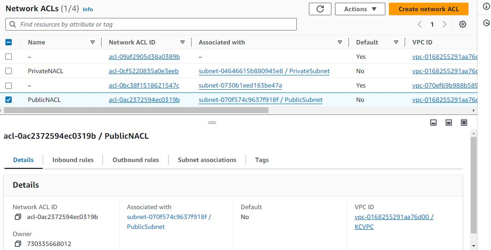

# Terraform Project

## Introduction
This project is used to set up and manage infrastructure using Terraform. The infrastructure includes a Virtual Private Cloud (VPC), EC2 instances, Security Groups, and more.

## Project Structure
Below is the directory structure of this Terraform project:

├── main.tf
├── modules
│   ├── vpc
│   │   ├── main.tf
│   |        ├──Subnets 
│   |        ├── internet_gateway
│   |        ├── nat_gateway
│   |        ├── security_groups
│   │        │── nacl
|   |
|   |
│   ├── ec2_instance
│   │   ├── main.tf
│   |   │   variables.tf
│   │   └── outputs.tf
├── outputs.tf
├── variables.tf
└── terraform.tfvars

### Execute the Terraform Configuration

**Initialize the Terraform configuration:**
 1. terraform init

**Create a Terraform plan and save it to a file**
 2. terraform plan -out tfplan

**Apply the Terraform plan to deploy the infrastructure:**

 3. terraform apply "tfplan"

**Verify the resources on AWS and take screenshots:**

**Once done, destroy the resources:**

 4. terraform destroy

### Detailed Report with Screenshots

1. VPC Creation: Screenshot showing the VPC created with the specified CIDR block.

2. Subnets: Screenshots showing the public and private subnets created.

3. Internet Gateway: Screenshot showing the IGW attached to the VPC.

4. NAT Gateway: Screenshot showing the NAT Gateway in the public subnet.

5. Route Tables: Screenshots showing the route tables and their associations.

6. Security Groups: Screenshots showing the security groups with the specified rules.

7. Network ACLs: Screenshots showing the NACLs and their rules.

8. EC2 Instances: Screenshots showing the EC2 instances in the public and private subnets.

By following these steps and using the provided Terraform configurations, you should be able to set up the required infrastructure on AWS successfully.